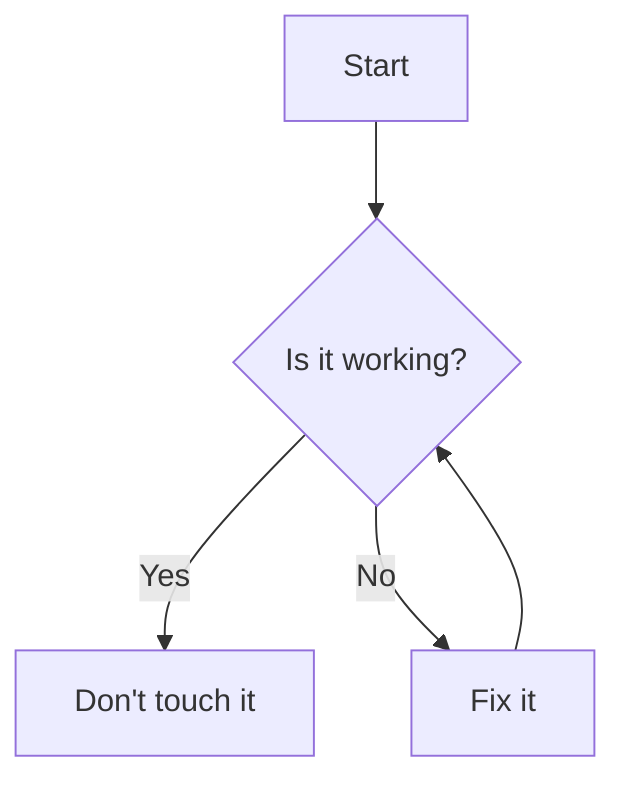
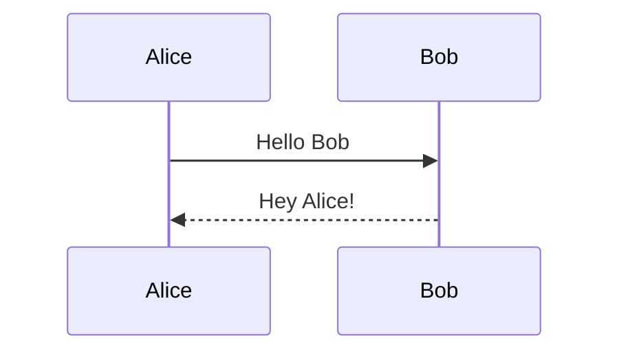
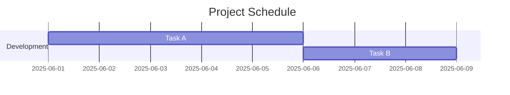
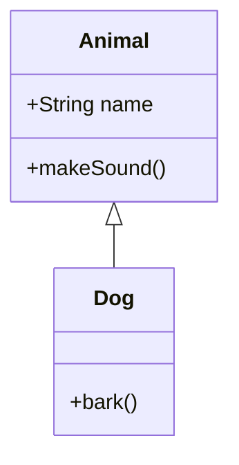

Sure Ganesh! Here's a quick **crash course on Mermaid** — it's a simple markdown-like language to create diagrams like flowcharts, sequence diagrams, Gantt charts, etc.

---

## 🧠 **Mermaid Basics**

You start with ` ```mermaid ` and end with ` ``` `.

---

## 🔁 **Flowchart**



* `TD` = Top Down (`LR` = Left to Right)
* `[]` = box, `()` = circle, `{}` = decision/condition

---

## 📞 **Sequence Diagram**



---

## 📊 **Gantt Chart**



---

## 🧱 **Class Diagram**



---

## 📍 Common Shapes

* `A[box]`
* `B(rounded)`
* `C((circle))`
* `D{{rhombus}}`
* `E>asymmetrical<]`
* `F[/parallelogram/]`

---

## 🔗 Arrows

* `-->` → default
* `-.->` → dashed
* `==>` → thick
* `-->|label|` → with label

---

## 🧪 Try Online

Use this live editor: [https://mermaid.live](https://mermaid.live)

---