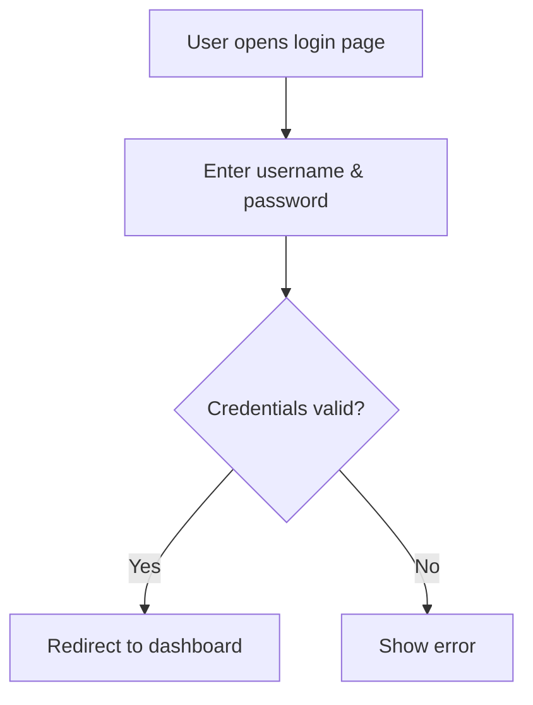
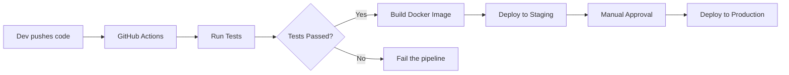
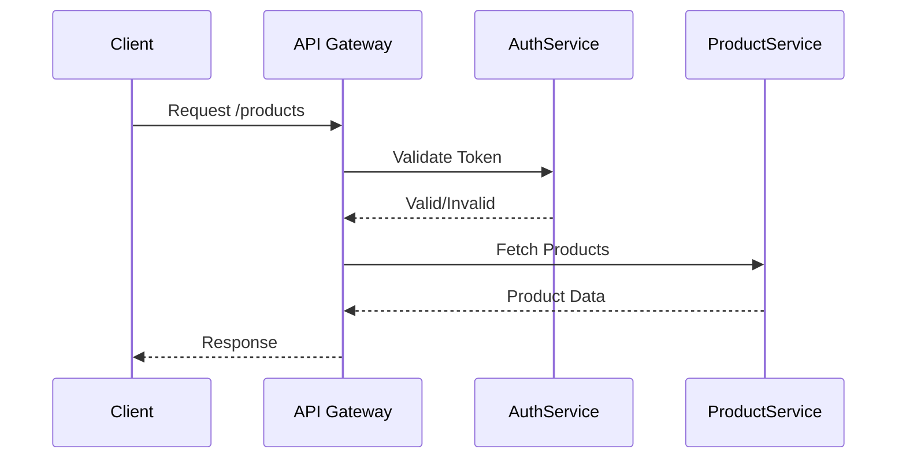

Awesome! Here's how Mermaid can model **real-world dev scenarios** 👇

---

### 🔐 **Login Flow (Flowchart)**



---

### ⚙️ **CI/CD Pipeline (Flowchart)**



---

### 🔄 **Microservices Communication (Sequence)**



---

### ⏳ **Software Project Gantt Chart**

```mermaid
gantt
  title Java Spring App Timeline
  dateFormat  YYYY-MM-DD
  section Planning
  Requirement Analysis :a1, 2025-06-20, 4d
  Design :a2, after a1, 3d

  section Development
  Backend :b1, after a2, 10d
  Frontend :b2, parallel with b1, 10d

  section Testing
  Unit Tests :c1, after b1, 3d
  Integration Test :c2, after c1, 2d
```