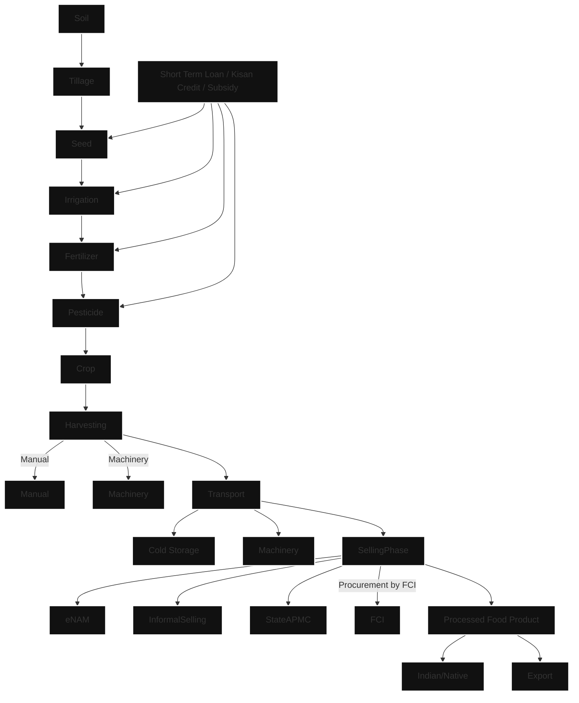

```mermaid
graph TD
  %% ========== Preparation Phase ==========
  Soil --> Tillage
  Tillage --> Seed

  %% ========== Input Phase ==========
  Seed --> Irrigation
  Irrigation --> Fertilizer
  Fertilizer --> Pesticide
  Pesticide --> Crop

  ShortTermLoan[Short Term Loan / Kisan Credit / Subsidy] --> Seed
  ShortTermLoan --> Irrigation
  ShortTermLoan --> Fertilizer
  ShortTermLoan --> Pesticide

  %% ========== Output Phase ==========
  Crop --> Harvesting
  Harvesting -->|Manual| Manual
  Harvesting -->|Machinery| Machinery

  %% ========== Storage Phase ==========
  Harvesting --> Transport
  Transport --> ColdStorage[Cold Storage]
  Transport --> StorageMachinery[Machinery]
  Transport --> SellingPhase

  %% ========== Selling Phase ==========
  SellingPhase --> eNAM
  SellingPhase --> InformalSelling
  SellingPhase --> StateAPMC
  SellingPhase -->|Procurement by FCI| FCI

  %% ========== Processed Product & Export ==========
  SellingPhase --> ProcessedFood[Processed Food Product]
  ProcessedFood --> IndianNative[Indian/Native]
  ProcessedFood --> Export

  %% ========== Styling (Optional) ==========
  classDef phase fill:#111,stroke:#fff,stroke-width:2px
  class Soil,Tillage,Seed,Irrigation,Fertilizer,Pesticide phase
  class Crop,Harvesting,Manual,Machinery phase
  class Transport,ColdStorage,StorageMachinery phase
  class SellingPhase,eNAM,InformalSelling,StateAPMC,FCI phase
  class ProcessedFood,IndianNative,Export phase
  class ShortTermLoan phase

```  