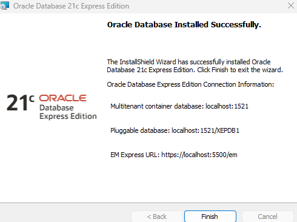

1. Download Oracle Express Edition from official website.  
2. Extract  
3. Setup  
4. choose Installation path  
5. choose password  
6. Finish installation & take a screenshot of last wizard step  
### Preview:  
  